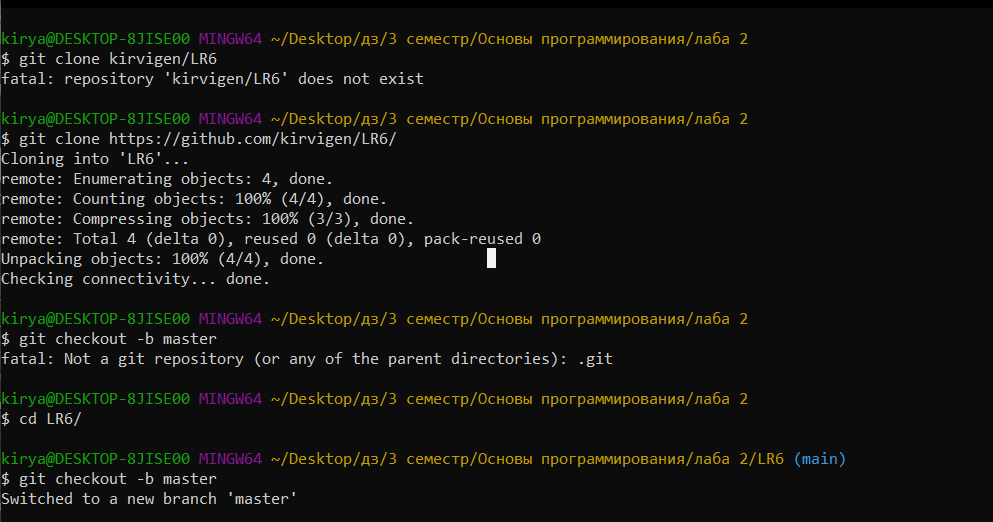
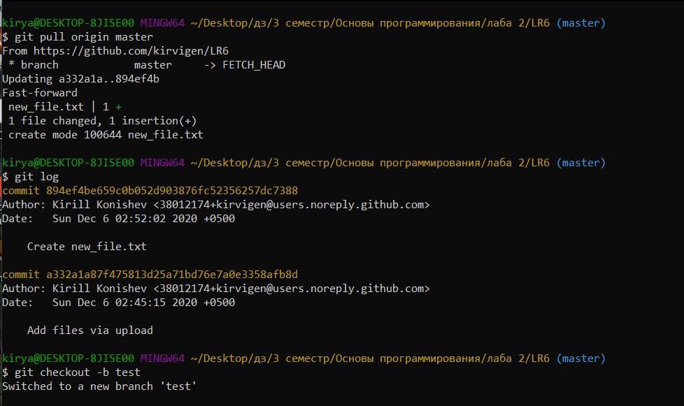
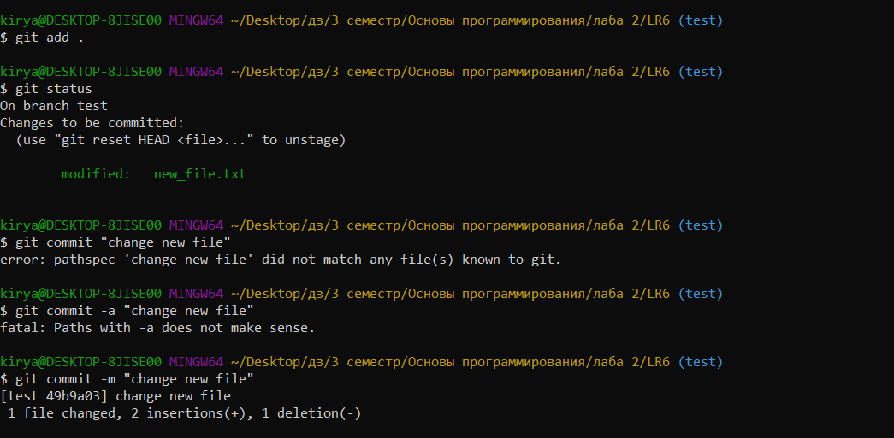
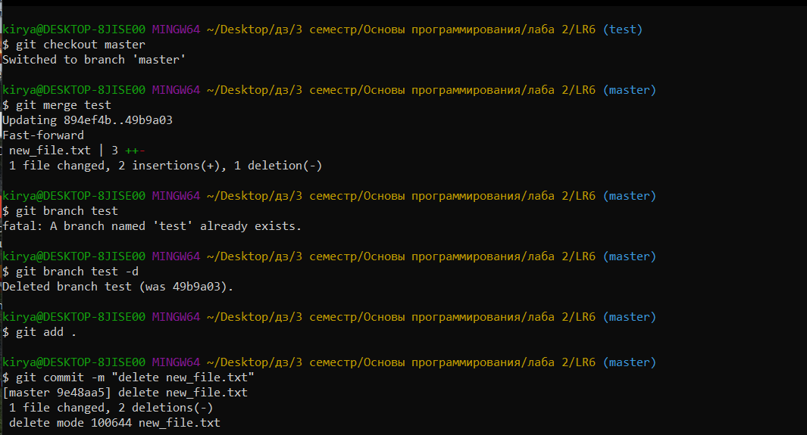
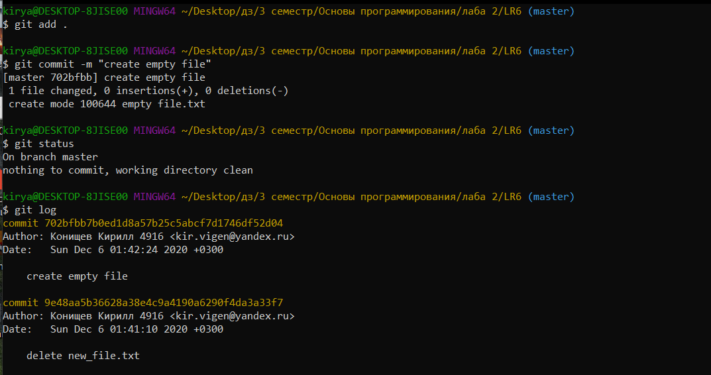
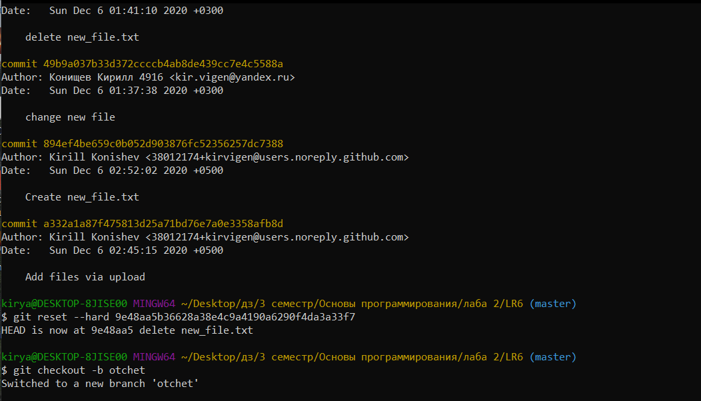
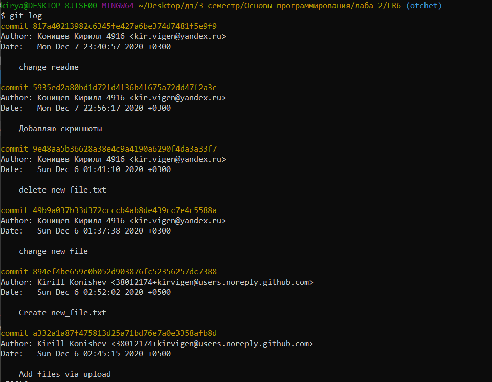

## Лабораторная работа - "СИСТЕМА КОНТРОЛЯ ВЕРСИЙ"

Загружаем репозиторий в локальную папку, переходим на ветку master.

Добавляем новый пустой файл "new_file.txt" через сайт github.com Подгружаем изменения с удаленного репозитория. Периодически смотрим на все изменения в репозитории. Переходим на новую ветку test

Изменяем локально файл new_file.txt и делаем коммит с комментарием "change new file"

Переходим обратно в ветку master, мержим ветку test и master. Удаляем ветку test.
Удаляем новый файл и коммитим изменения в ветку с комментарием "delete new_file.txt"

Создал пустой файл и закоммитил его в ветку master

Удаляем коммит с созданием пустым файлом перехожу на отчет. Переходим на ветку otchet.

Финальный лог
